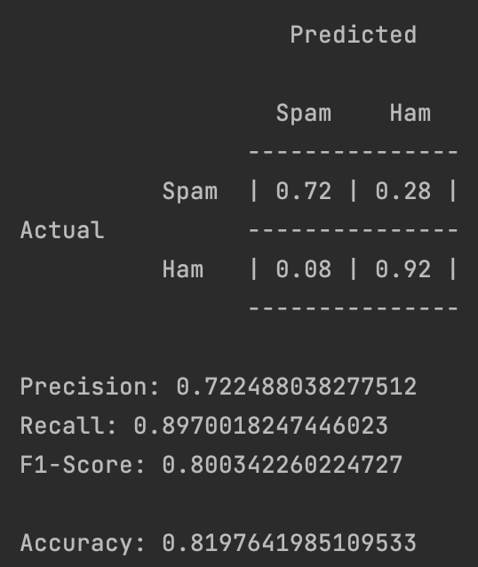
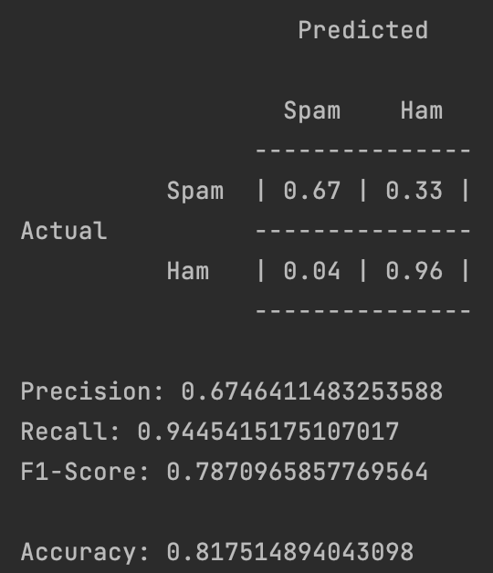

# Bayes-Spam-Filter

Team: Mike Gilgen, Yannick Koller

## Unbekannte Wörter

Wenn ein Wort **nicht** im Testdatensatz vorkommt, erhält dieses Wort eine Wahrscheinlichkeit von 0. Durch die
Multiplikation der Wahrscheinlichkeiten aller Wörter wird die Wahrscheinlichkeit des gesammten Emails auch 0.

## Kalibrierung

Der Threshold von 0.5 hat sich bei allen Experimenten bewährt.

Als optimalen Wert für &alpha; hat sich der Wert 0.01 herausgestellt. Dieser Wert liefert den besten trade-off zwischen
korrekter Klassifizierung von Spam-Emails und möglichst tiefer Fehlklassifizierung von Ham-Emails.

| &alpha; = 0.1             | &alpha; = 0.01 | &alpha; = 0.001 | 
| --- | --- | --- |
|   |  |  |

## Klassifizierung

| Threshold | &alpha; | Confusion matrix |
| --- | --- | --- |
| 0.5 | 0.01 |  |
