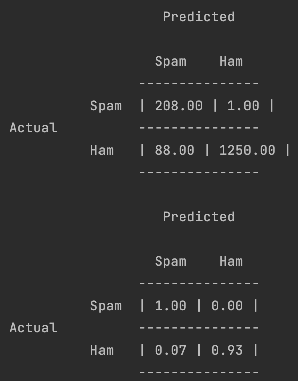
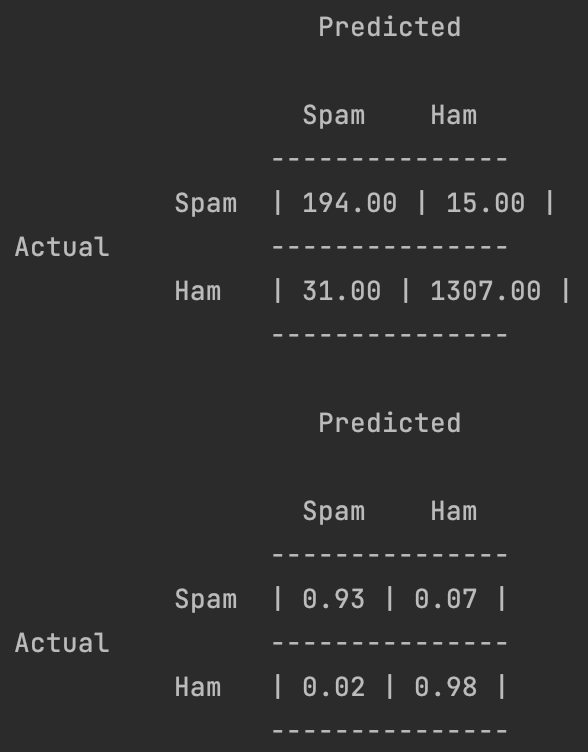

# Bayes-Spam-Filter

Team: Mike Gilgen, Yannick Koller

## Unbekannte Wörter

Wenn ein Wort **nicht** im Testdatensatz vorkommt, erhält dieses Wort eine Wahrscheinlichkeit von 0. Durch die
Multiplikation der Wahrscheinlichkeiten aller Wörter wird die Wahrscheinlichkeit des gesammten Emails auch 0.

## Kalibrierung

Ein Threshold von 0.5 hat sich bei allen Experimenten als gut erwiesen.

Nach einigen Experimenten mit dem Wert &alpha; hat sich herausgestellt, dass Werte kleiner als &alpha; = 0.01 bereits
gute Resultate liefern.

Wir haben uns jedoch bewusst gegen den Wert 0.01 entschieden da es uns sehr wichtig war so wenige Ham-Emails als Spam zu
markieren als nur möglich.
Da man ab Werten kleiner als &alpha; = 1E-8 vor allem an korrekten Spam-Klassifizierungen verliert, haben wir uns für
diesen Wert
entschieden.

| &alpha; = 1           | &alpha; = 1E-2           | &alpha; = 1E-4           | &alpha; = 1E-8           | &alpha; = 1E-12           | &alpha; = 1E-16           |
|-----------------------|--------------------------|--------------------------|--------------------------|---------------------------|---------------------------|
|  |  |  |  |  |  |

## Klassifizierung

| Threshold  | &alpha;     | Confusion matrix             |
|------------|-------------|------------------------------|
| 0.5        | 0.000000001 |  |
