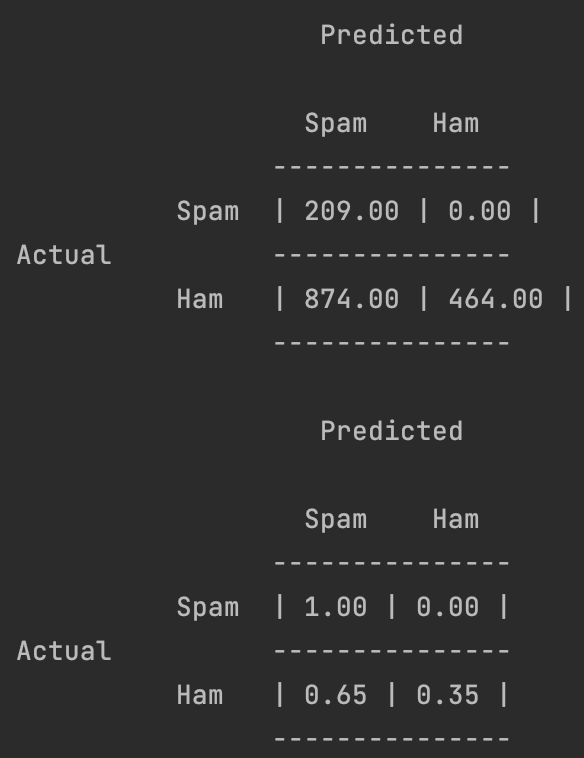
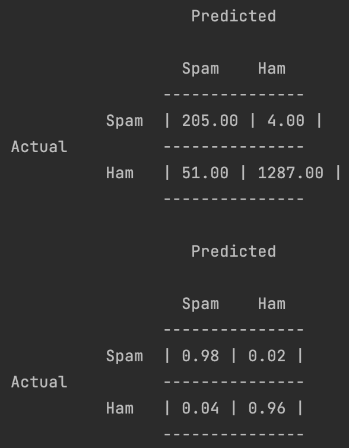
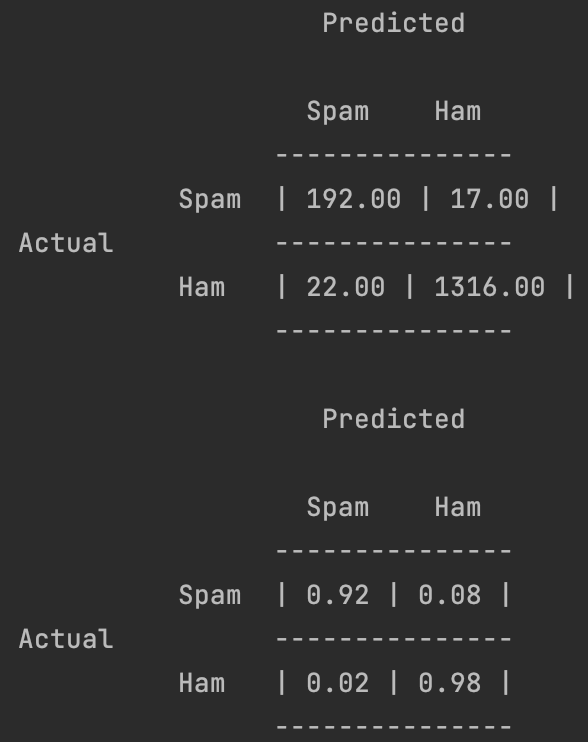

# Bayes-Spam-Filter

Team: Mike Gilgen, Yannick Koller

## Unbekannte Wörter

Wenn ein Wort **nicht** im Testdatensatz vorkommt, erhält dieses Wort eine Wahrscheinlichkeit von 0. Durch die
Multiplikation der Wahrscheinlichkeiten aller Wörter wird die Wahrscheinlichkeit des gesammten Emails auch 0.

## Kalibrierung

Bei den Experimenten lässt sich unschwer erkennen, dass der Spung zwischen den Werten 1 und 0.01 bereits massive
Verbesserungen mit sich bringt. Jedoch werden mehr als 80 legitime Mails in den Spam-Ordner verschoben. Bei stetigem
verkleinern des Wertes von &alpha; lässt sich erkennen, dass die Fehlerquote bei Ham-Mails sich drastisch verbessert und
man auf der Spam-Seite nur leicht mehr Fehler macht. Ab Werten kleiner als 1E-16 lassen sich kaum mehr relevante
Änderungen an den Klassifikationen erkennen.

Daher haben wir uns für den Wert 1E-16 entschieden.

| &alpha; = 1           | &alpha; = 1E-2           | &alpha; = 1E-4           | &alpha; = 1E-8           | &alpha; = 1E-12           | &alpha; = 1E-16           |
|-----------------------|--------------------------|--------------------------|--------------------------|---------------------------|---------------------------|
|  |  |  |  |  |  |

Der Threshold von 0.5 hat sich bei allen Experimenten als gut erwiesen.

## Klassifizierung

| Threshold  | &alpha; | Confusion matrix             |
|------------|---------|------------------------------|
| 0.5        | 1E-16   |  |
